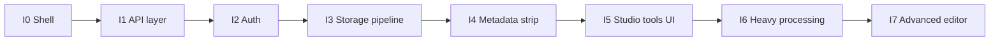

# Implementation orchestration (active)

This is the **execution order** for implementers. It does **not** copy the old app’s flows; it only aligns with `deps.md`, `TECHNICAL-REQUIREMENTS.md`, and the current Vite + React Router + nuqs shell.

---

## Current baseline (already in repo)

| Item | Location |
|------|----------|
| Router + nuqs v7 adapter | `src/router.tsx`, `src/main.tsx` |
| Studio URL state | `src/lib/search-params.ts`, `src/pages/StudioPage.tsx` |
| Routes | `/`, `/auth/login`, `/studio`, `/studio/:jobId` |
| TanStack Query | `QueryClientProvider` in `main.tsx` |
| Placeholder pages | `src/pages/HomePage.tsx`, `LoginPage.tsx` |

---

## Phase order (do not skip gates)



---

### I0 — Client shell **DONE**

- [x] React Router + `NuqsAdapter` + `studioParsers`
- [x] Query client for future jobs / polling

**Gate:** `bun run build` passes.

---

### I1 — API boundary & env **DONE**

**Goal:** One place for `fetch`, base URL, and typed env so the SPA does not scatter secrets or raw strings.

**Tasks:**

1. ~~Add `src/lib/env.ts` — parse `import.meta.env` with **zod** (only `VITE_*` keys exposed to client).~~
2. ~~Add `src/lib/api/client.ts` — `apiFetch(path, init)` with credentials, JSON helpers, error shape.~~
3. ~~Document required `VITE_*` vars in `README.md` (names only, no values).~~ Also `src/vite-env.d.ts`, `.env.example`, `getEnv()` at startup in `main.tsx`.

**Handoff to I2:** Implementer tags `[IMPLEMENTER]` in `progress.MD` with files added; **Reviewer** checks no secrets in client bundle.

---

### I2 — Custom auth (new design) **DONE (client)**

**Goal:** Session or JWT **without** replaying the failed app’s job/queue coupling.

**Tasks:**

1. **Backend** (separate): login, logout, `me` — still required for production; client expects `GET /api/me`, `POST /api/auth/login`, `POST /api/auth/logout`.
2. ~~**Client:** `LoginPage` form → API; **httpOnly cookie** via `credentials: 'include'`.~~
3. ~~**Guards:** `AuthProvider` + `ProtectedRoute` for `/studio`.~~
4. ~~**TanStack Query:** `useQuery` for `me`, `useMutation` for login/logout.~~
5. ~~**Vite dev:** `server.proxy` `/api` → `VITE_DEV_API_PROXY` or `http://127.0.0.1:3000`.~~

**Dependencies:** I1 client + env.

**Handoff:** `[IMPLEMENTER]` (subagent) logged files; **Progress** marks Phase I2 client done.

---

### I3 — File storage pipeline **DONE (client)**

**Goal:** Uploads that **do not** keep full files in React state; **large files** use streaming / multipart to Blob.

**Tasks:**

1. **Backend** still required for `POST /api/assets`, `POST /api/blob/upload` (handleUpload), `POST /api/assets/:id/complete` — see `src/lib/uploads/README-contract.md`.
2. ~~`@vercel/blob` **client upload** via `useUploadFlow` + `AssetDropzone`.~~
3. ~~**UI:** Home → upload → `/studio/:assetId`.~~
4. **Rule:** enforced in dropzone (file in ref, cleared on upload start).

**Handoff:** `[REVIEW]` when server implements contract.

---

### I4 — Metadata removal (all types) **DONE (client v1)**

**Goal:** Strip metadata per type; **small** files client-side where safe; **large** or slow → server job.

**Tasks:**

1. ~~Processors: `detectCategory`, `stripImageMetadata`, `stripPdfMetadata`, `stripVideoMetadata` (stub / size guard).~~
2. **Threshold:** video ≥50MB skips full read; server path TBD.
3. ~~**Studio** `metadata` tool → `MetadataTool`.~~

**Dependencies:** I3 for input/output URLs when using Blob pipeline.

---

### I5 — Studio tool routing (UI shells) **DONE**

**Goal:** Each `tool` in `studioParsers` maps to a real panel component (can be empty state first).

**Tasks:**

1. ~~`toolRegistry` + lazy panels + `StudioToolContent`.~~
2. ~~`StudioPage` renders `StudioToolContent` + tool buttons.~~
3. Deep links via nuqs.

**Dependencies:** I7 fills non-placeholder behavior.

---

### I6 — Heavy processing (encode / transcode) **CLIENT HOOK DONE**

**Goal:** FFmpeg-class work **off the main thread** — server or long-running worker with progress.

**Tasks:**

1. ~~`useJob` + `GET /api/jobs/:id` polling; Studio shows job strip when `jobId` in URL.~~
2. **Server:** FFmpeg + job status — still required for real encode.
3. **Encode tool** panel remains placeholder until server exists.

**Dependencies:** I3 + I4.

---

### I7 — Advanced (checklist)

**Goal:** Overlays (Konva), audio (Tone preview + FFmpeg export), optional Whisper captions — **independent PRs** per vertical.

**Tasks:** See product checklist in `TECHNICAL-REQUIREMENTS.md` client vs server matrix.

---

## Agent instructions (per phase)

| Agent | Action |
|-------|--------|
| **Orchestrator** | After each phase, update `progress.MD` `[ORCHESTRATOR]` with next phase and blockers. |
| **Implementer** | One phase per PR or commit series; log paths in `[IMPLEMENTER]`. |
| **Dependencies** | Append only new lines to `deps.md` when a phase needs a package. |
| **Reviewer** | Run checklist in main `ORCHESTRATOR.md` + storage scoping after I3. |
| **Progress** | Update table in `progress.MD` — never leave “In progress” stale. |

---

## Phase status (mirror of `progress.MD`)

Single source of truth for **status** is `progress.MD` → `[PROGRESS]` table. This doc defines **what** each phase does; **Progress** tracks **done**.

---

## Blocker protocol

If a phase is blocked, append to `progress.MD`:

```text
### YYYY-MM-DD — [IMPLEMENTER] (blocked)
- Phase: Ix
- Reason: …
- Needs: decision from user / ORCHESTRATOR / infra
```

---

## Next action (start here)

**Implement I7** — advanced editor: Konva overlays, Tone audio preview, optional Whisper; **server-side FFmpeg** for encode jobs. Use **Task subagents** per vertical slice.

**Parallel:** Use **Task** `generalPurpose` for implementation — see `docs/ORCHESTRATOR.md` → Subagent workflow.
